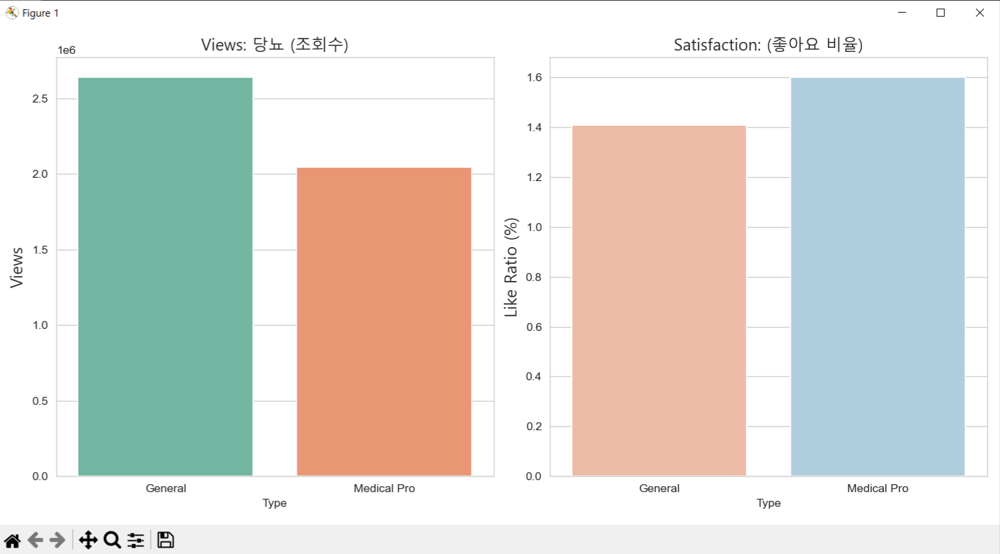
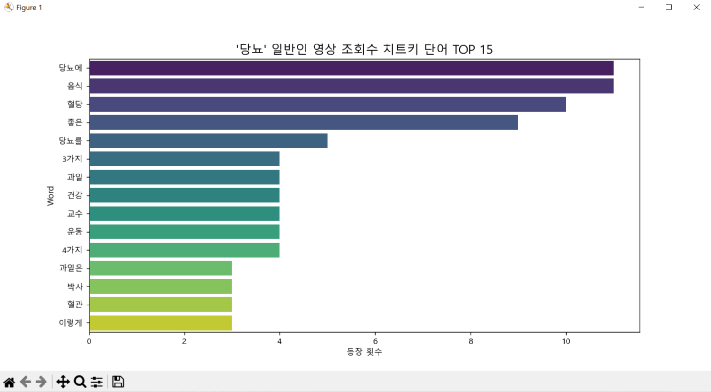
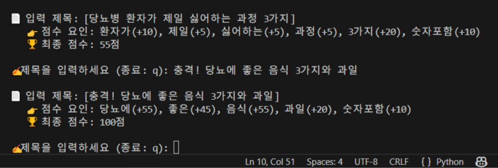

# 🏥 YouTube Medical Content Optimizer (의료 정보 접근성 강화 프로젝트)


> **데이터 분석을 통해 의료 정보의 확산 패턴을 규명하고, 조회수를 극대화하는 AI 제목 최적화 솔루션**

## 📌 1. 프로젝트 개요 (Overview)

* **주제:** YouTube 내 의료 건강 정보(당뇨 등) 콘텐츠의 알고리즘 확산 패턴 분석 및 제목 생성 알고리즘 개발
* **목표:** 전문성은 높지만 접근성이 낮은 의료인(Medical Pro)의 콘텐츠가 대중에게 더 잘 도달할 수 있도록, 일반인 인플루언서의 성공 문법(Keyword Pattern)을 분석하여 적용함.
* **개발 기간:** 2025.12.31 (1-Day Intensive Project)
* **역할:** 데이터 수집(ETL), 전처리, 시각화(EDA), 모델링 전 과정 1인 개발

## 💡 2. 문제 정의 및 가설 (Hypothesis)

* **문제점:** 의학적으로 정확한 정보를 제공하는 '의료인' 채널보다, 자극적인 썸네일을 사용하는 '일반인' 채널의 조회수가 월등히 높은 현상 발견.
* **가설:** "일반인 유튜버들은 시청자의 클릭을 유도하는 특정 **'트리거 키워드(Trigger Keyword)'**를 패턴화하여 사용하고 있을 것이다."
* **검증 방법:** '당뇨(Diabetes)' 키워드 상위 50개 영상 데이터를 수집하여 **[전문가 그룹 vs 일반인 그룹]** 간의 성과 지표를 비교 분석.

## 📊 3. 데이터 분석 과정 (Process & Insight)

### 3-1. 데이터 수집 (Data Collection)

* **Google YouTube Data API v3**를 활용하여 키워드 관련 상위 노출 영상의 메타데이터(제목, 조회수, 좋아요, 채널명 등) 수집.
* `viewCount` 기준 정렬을 통해 시장에서 이미 검증된 고성과 영상(Best Practice) 표본 추출.

### 3-2. 탐색적 데이터 분석 (EDA)

* **정량적 비교:** 분석 결과, 일반인 그룹의 평균 조회수가 전문가 그룹 대비 **약 1.4배 높음**을 확인. 반면, 신뢰도 지표인 '좋아요 비율(Like Ratio)'은 전문가 그룹이 우세함.
* **인사이트:** 의료 콘텐츠의 확산을 위해서는 **'전문가의 신뢰성'에 '일반인의 마케팅적 키워드'를 결합**하는 전략이 필요함.

<p align="center">
  
  <br>
  <em>[Figure 1] 전문가 그룹(Medical Pro) vs 일반인 그룹(General) 성과 비교</em>
</p>

### 3-3. 텍스트 마이닝 (Text Mining)

* **형태소 분석(Tokenizing):**
  일반인 그룹의 영상 제목을 단어 단위로 분리하여 빈도수 분석을 수행함. 제목 내 핵심 단어들의 출현 패턴을 파악하기 위해 불용어 제거 후 Tokenizing을 진행함.

* **핵심 키워드 추출:**
  분석 결과, `당뇨에`, `음식`, `혈당`, `좋은`, `과일`, `3가지`, `교수` 등의 키워드가 압도적으로 높은 빈도(TF)로 등장함을 확인함.
  이는 시청자들이 **질병 자체보다 ‘해결 방법’과 ‘즉각적 행동 가이드’에 더 큰 관심**을 보인다는 점을 시사함.

* **패턴 도출 (Trigger Keyword Pattern):**

  * **직관적 해결책 제시:**
    `음식`, `과일`, `좋은` 등의 키워드를 제목 전면에 배치하여, 시청자가 영상 시청 후 바로 실생활에 적용할 수 있을 것이라는 기대감을 형성함.
  * **정보의 수치화:**
    `3가지`, `4가지`와 같은 구체적인 숫자를 활용해 콘텐츠의 범위를 명확히 제시하고, “짧은 시간 안에 핵심만 얻을 수 있다”는 인식을 강화함.
  * **신뢰도 보완 및 권위 차용:**
    `교수`, `박사`, `의사` 등 전문가 타이틀을 키워드로 활용하여, 일반인 채널이 가질 수 있는 정보 신뢰도에 대한 불안을 상쇄하고 클릭을 유도함.

> **Insight:**
> 일반인 유튜버들의 고조회수 제목은 단순한 자극이 아니라,
> **「실행 가능한 해결책 + 명확한 구조(숫자) + 권위의 상징」**이라는 반복 가능한 제목 문법을 기반으로 구성되어 있음을 확인함.

<p align="center">
  
  <br>
  <em>[Figure 2] 일반인 유튜버들의 조회수 Trigger Keyword TOP 15</em>
</p>

## 🤖 4. 솔루션 개발: AI 제목 판독기 (AI Title Scorer)

* **기능:** 사용자가 입력한 제목의 '잠재 조회수 효율'을 예측하여 **0~100점의 점수**로 환산해주는 알고리즘 개발.
* **로직 (Technical Core):**

  * **실시간 전처리 엔진(`processor.py`)**: 사용자 입력값에서 불필요한 특수문자, 태그(`[ ]`, `( )`), 이모지 등을 **정규표현식(Regex)**으로 즉시 정제하여 판독 정확도를 향상함.
  * **데이터 일관성 확보**: 학습 데이터와 사용자 입력 데이터에 동일한 전처리 파이프라인을 적용하여 신뢰도 높은 평가 모델 구축.
  * **가중치 부여**: 텍스트 마이닝으로 추출한 고효율 키워드에 빈도 기반 가중치를 부여하여 단순 매칭 이상의 평가 수행.
* **전처리 도입 배경:** > "유튜브 제목 특성상 특수문자와 문장 부호가 클릭률에 큰 영향을 미치지만, 데이터 기반의 정확한 키워드 가중치 분석을 위해 노이즈를 제거하는 실시간 전처리 엔진을 구현하였습니다. 이를 통해 장식에 가려진 '핵심 트리거 단어'의 성과를 객관적으로 측정합니다."
* **성과:** `youtube_analyzer.py` 구현 완료. 실제 테스트 결과, 최적화된 키워드 조합 시 예측 점수 100점 달성 및 조회수 상승 요인 실시간 피드백 성공.

<p align="center">
  
  <br>
  <em>[Figure 3] AI Title Scorer 실제 구동 화면 (전처리 엔진 적용 및 100점 달성 예시)</em>
</p>

## 🛠 5. 기술 스택 (Tech Stack)

* **Language:** Python 3.x
* **Data Collection:** Google API Client (YouTube Data API v3)
* **Data Analysis:** Pandas, NumPy
* **Visualization:** Matplotlib, Seaborn
* **Text Processing:** **Re (Regular Expression)**, Collections

## 🚀 6. 시작하기 (Getting Started)

### 설치 (Installation)
1. 저장소를 클론합니다.
```bash
git clone [https://github.com/사용자명/Medical-Content-Optimizer.git](https://github.com/사용자명/Medical-Content-Optimizer.git)
```

2. 저장소를 클론합니다.
```bash
cd Medical-Content-Optimizer
```

3. 필요한 패키지를 설치합니다.
```bash
pip install -r requirements.txt
```

### 실행 (Execution)
## AI 제목 판독기 실행:
```bash
python youtube_analyzer.py
```
명령어를 실행한 후, 분석하고 싶은 유튜브 제목을 입력하여 점수를 확인하세요.

## 📂 7. 프로젝트 구조 (File Structure)

```bash
youtube_study/
├── archive/                 # 📜 학습 과정 아카이브 (초기 모델링 기록)
├── images/                  # 🖼️ README용 이미지 리소스 저장소
├── processor.py             # 🛠️ 실시간 텍스트 전처리 모듈 (Regex 엔진)
├── youtube_analyzer.py      # ⭐ [Main] 최종 완성된 AI 제목 판독기 (게임 모드)
├── medical_final.csv        # 💾 수집된 원본 데이터 (Raw Data)
├── medical_cleaned.csv      # 💾 전처리 완료 데이터 (Processed Data)
├── .gitignore               # 🚫 Git 업로드 제외 설정 (캐시 및 환경 파일 관리)
├── requirements.txt         # 📦 의존성 패키지 목록
└── README.md                # 📄 프로젝트 명세서
```

## 🎯 8. 결론 및 기대효과 (Conclusion)

**결론**: 본 프로젝트를 통해 고성과 의료 콘텐츠는 단순 자극이 아닌 **'정보의 구조화'**와 **'전문성 인용'**의 조화로 이루어짐을 데이터로 증명함.

**기대효과**: 전문가의 전문 지식을 대중 친화적인 언어로 치환하는 가이드라인을 제공하여 올바른 의학 정보 확산에 기여함.

**향후 과제**: 질환군 데이터를 확장하여 범용적인 제목 추천 알고리즘으로 고도화 예정.